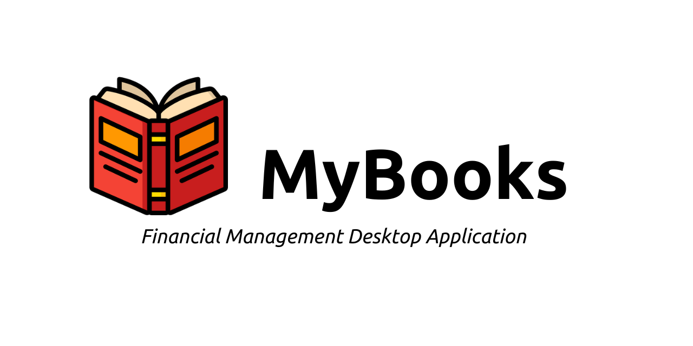
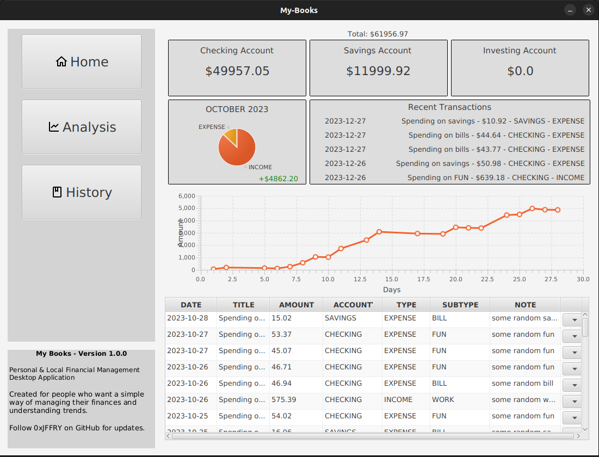
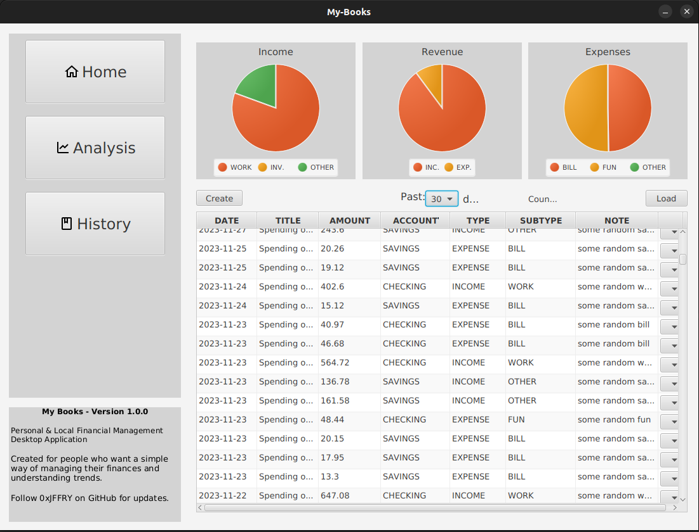

# MyBooks
*Financial Management Desktop Application*

Lightweight desktop application that will help you manage your finances, track profit/loss through time, analyze trends, generate budgets, view past transactions, and much more. This application is simple, yet powerful and easy to use; it's been primarily tailored for personal use, rather than for business/organization use. You'll be able to hold 3 accounts (checking, savings, investing) in which you will store all of your assets. With each account you'll be able to store transactions pertaining to that account and details for each transaction. All information created and deleted from the application will be managed by the program and saved onto a *local* SQLite3 database found within the application installation path.

Application is built purely with **_Java SDK 21, Gluon JavaFX_** & **_SQLite3 JDBC_**. I used the MVC (Model-View-Controller) architectual pattern and OOP concepts to design this application; which allows me to retain maintainability, allow for future development and increase readibility. At the beginning this application was only intended to be for myself, but once I realised it recevied a few downloads Im deciding to put it up here. 

### Snapshots

 

Download it now and begin simplifying your financial life!

**_Jeffery_**
